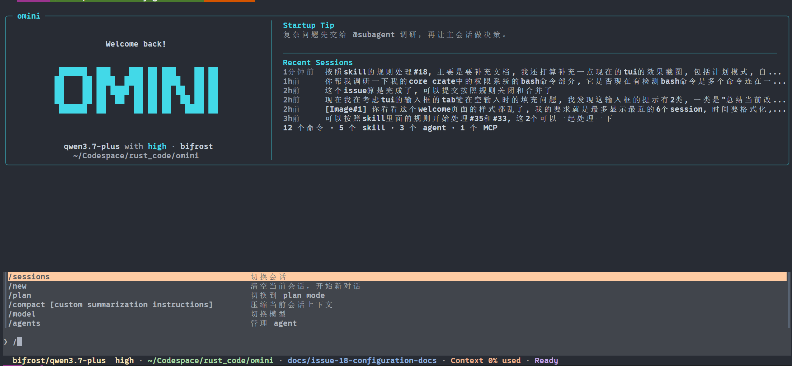
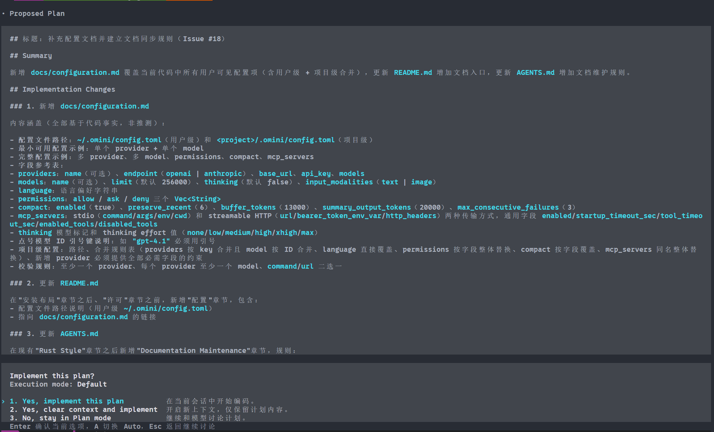
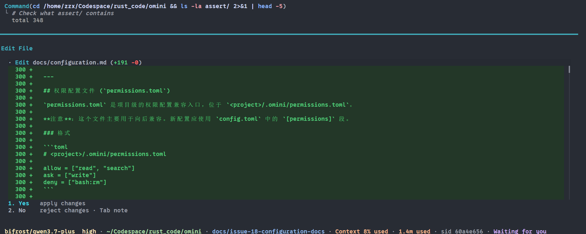
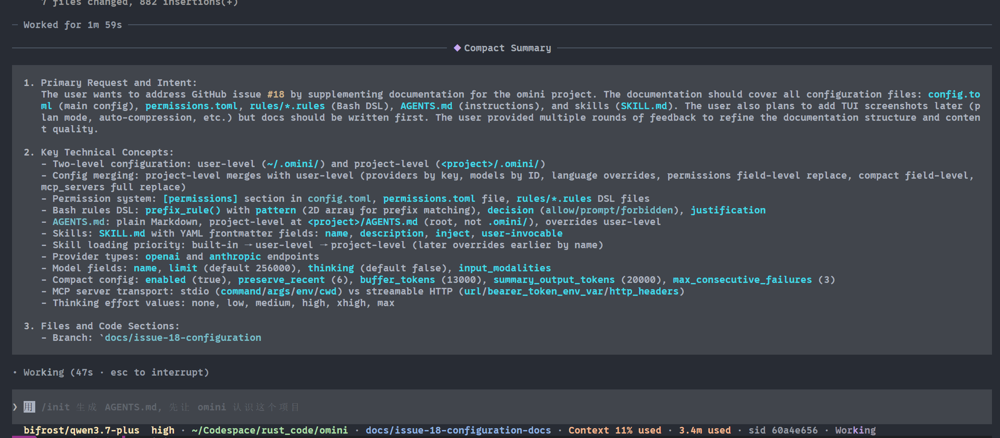

<div align="center">

# omini

</div>

## 功能预览

### 主界面



### 计划模式

支持在执行前进行任务规划，先展示计划再执行：



### 权限管理

内置权限系统，支持工具调用和 Bash 命令的细粒度权限控制：



### 上下文压缩

自动/手动压缩历史对话，保持上下文窗口在限制范围内：



## 构建

```bash
cargo build -p omini -p omini-server
```

## 安装布局

发布包固定包含：

```text
bin/omini
bin/omini-server
bin/rg
```

安装脚本会把用户命令 `omini` 安装到 `~/.local/bin/omini`，把内部依赖
`omini-server` 和 `rg` 安装到 `~/.omini/bin/`。运行时 `omini` 从 `OMINI_SERVER_BIN`
或 `~/.omini/bin/omini-server` 启动 daemon，search 工具固定调用 `~/.omini/bin/rg`，
不依赖用户 `PATH` 中的 `rg`。若 `rg` 丢失或损坏，server 会下载当前版本 Release
中的匹配二进制并校验 SHA-256。下载失败不会阻止 daemon、配置引导或 Web/TUI 连接，
但新的 agent run 会明确报告 search 依赖不可用。

## 安装

当前 Release 支持 macOS Apple Silicon 和 Linux x86_64：

```bash
curl -fsSL https://github.com/zhangzhenxiang666/omini/releases/latest/download/install.sh | sh
```

设置 `OMINI_VERSION=0.1.0` 可安装指定版本。脚本不会修改 shell 配置；请确保
`~/.local/bin` 已在 `PATH` 中。

## 配置

Omini 支持用户级和项目级两层配置：

- **用户级配置**：`~/.omini/config.toml`（全局生效）
- **项目级配置**：`<project>/.omini/config.toml`（可选，仅当前项目生效）

项目级配置会与用户级配置自动合并，支持为特定项目定制 provider、模型、MCP server 等。
daemon 即使没有最小配置也会启动。首次打开一个尚未配置的项目时，TUI 会调用服务端
配置接口显示引导页；TUI 不直接写配置文件，未来 Web 客户端可使用同一接口。

详细配置说明请参考 [配置文档](docs/index.md)，包括：

- [配置参考](docs/configuration.md) — 主配置文件
- [权限配置](docs/permissions.md) — 权限规则和 Bash 规则 DSL
- [Agent 指令](docs/instructions.md) — AGENTS.md 文件格式
- [Skills 配置](docs/skills.md) — 可复用技能包

## 许可

MIT
